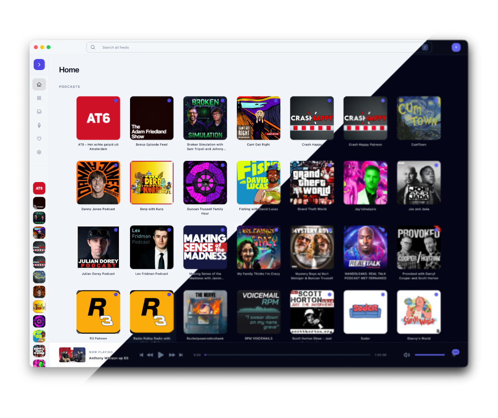

# JRSS

[](package.json)
[](LICENSE)
[](src-tauri/tauri.conf.json)

JRSS is a local-first desktop RSS reader and podcast player built with Tauri 2, SvelteKit 2, Svelte 5, Rust, and SQLite. It ingests RSS and Atom feeds into a local database, extracts cleaner reader-mode content for articles, and runs podcast playback through a native backend with queue persistence and session restore.



## Table of Contents

- [What JRSS Does](#what-jrss-does)
- [Why JRSS Is Useful](#why-jrss-is-useful)
- [Getting Started](#getting-started)
- [Project Layout](#project-layout)
- [Architecture](#architecture)
- [Getting Help](#getting-help)
- [Maintainers And Contributing](#maintainers-and-contributing)
- [License](#license)

## What JRSS Does

JRSS combines feed reading and podcast listening in one desktop app.

- Subscribe with a direct RSS/Atom URL, an Apple Podcasts URL, or an Apple Podcasts ID
- Store feeds, items, playback state, queue state, stations, and settings locally in SQLite
- Read article content in feed view or switch to extracted reader view
- Play podcast episodes with queueing, history, progress tracking, and playback restore
- Group podcast feeds into reusable stations with their own filters and sort order
- Refresh feeds in the background and manage local audio cache and playback settings
- Inspect raw feed XML when debugging feed parsing problems

## Why JRSS Is Useful

- Local-first by default: app data lives on the user's machine in `jrss.sqlite3`
- One workflow for articles and podcasts instead of separate tools
- Native backend handles playback, queue management, media controls, and persistence
- Reader extraction makes long-form content easier to read than raw feed markup
- Desktop UX includes keyboard shortcuts, a mini-player window, and native menus

## Getting Started

### Prerequisites

- [Bun](https://bun.sh/)
- Rust 1.87+ and Cargo
- Tauri system dependencies for your OS: <https://v2.tauri.app/start/prerequisites/>

JRSS uses `bun.lock`. Use Bun for installs and script execution.

### Install

```sh
bun install
```

### Run The Desktop App

```sh
bun run tauri:dev
```

This is the main development flow. Tauri starts the Vite dev server for you at `http://127.0.0.1:1420`.

### Run Frontend-Only

```sh
bun run dev
```

Use this only for UI-only work. Tauri-backed features intentionally return empty/default data outside the desktop runtime.

### Common Commands

| Command                                            | Purpose                                 |
| -------------------------------------------------- | --------------------------------------- |
| `bun run tauri:dev`                                | Run the full desktop app in development |
| `bun run dev`                                      | Run the frontend only                   |
| `bun run check`                                    | Run `svelte-check`                      |
| `bun run lint`                                     | Run Prettier and ESLint                 |
| `bun run test`                                     | Run frontend and state Vitest tests     |
| `bun run build`                                    | Build the frontend bundle               |
| `bun run tauri:build`                              | Build packaged desktop binaries         |
| `cargo check --manifest-path src-tauri/Cargo.toml` | Typecheck the Rust backend              |
| `cargo test --manifest-path src-tauri/Cargo.toml`  | Run Rust unit tests                     |

Recommended validation order for frontend work:

```sh
bun run check && bun run lint && bun run build
```

### Typical Usage

1. Start the app with `bun run tauri:dev`.
2. Add a feed using an RSS/Atom URL or Apple Podcasts link/ID.
3. Browse `All`, `Unread`, or `Media` items.
4. Open an article in reader mode or queue a podcast episode.
5. Create a station to group podcasts for repeated listening.

### Developer Notes

- `bun run tauri:dev` already starts `bun run dev`; do not run a second Vite server.
- App startup happens in `src/hooks.client.ts` via `initializeApp()` in `src/lib/state/index.ts`.
- New settings and IPC fields require coordinated changes across TypeScript types, Rust models, and SQLite schema. See [AGENTS.md](AGENTS.md).

## Project Layout

- `src/`: SvelteKit frontend, Svelte 5 components, runes-based state modules, and Tauri wrappers
- `src/lib/state/`: frontend domain state and actions facade used across the app
- `src/lib/services/`: frontend service boundary for feed, item, station, playback, and settings operations
- `src-tauri/src/`: Rust backend commands, feed ingestion, reader extraction, playback, menu wiring, and database access
- `src-tauri/src/db/`: SQLite schema, migrations, and query modules
- `img/`: screenshots and project imagery
- `CONTRIBUTING.md`: contributor workflow and validation expectations
- `.github/CODEOWNERS`: repository ownership

## Architecture

High-level flow:

```text
Svelte UI/state -> frontend services -> Tauri invoke layer -> Rust commands -> SQLite/audio services
```

Key implementation points:

- Frontend is a SPA: `src/routes/+layout.ts` sets `prerender = true` and `ssr = false`
- State is organized by domain in `src/lib/state/*.svelte.ts`
- Feed ingestion and Apple Podcasts resolution live in `src-tauri/src/feed_ingest.rs`
- Reader extraction lives in `src-tauri/src/reader_extract.rs`
- Playback, queue state, media controls, and mini-player integration live in `src-tauri/src/audio/` and `src-tauri/src/queue.rs`
- Persistent data is stored in the Tauri app-data directory as `jrss.sqlite3`

Useful built-in shortcuts include:

- `CmdOrCtrl+,`: open settings
- `CmdOrCtrl+N`: add feed
- `CmdOrCtrl+Shift+N`: create station
- `CmdOrCtrl+R`: refresh feed
- `CmdOrCtrl+F`: search feed
- `CmdOrCtrl+L`: go to feed
- `Space`: play or pause
- `CmdOrCtrl+Shift+Left` / `CmdOrCtrl+Shift+Right`: skip backward or forward

## Getting Help

- Report bugs or request features: <https://github.com/jascha030/JRSS/issues>
- Read the contributor guide: [CONTRIBUTING.md](CONTRIBUTING.md)
- Review repository-specific implementation notes: [AGENTS.md](AGENTS.md)
- Tauri docs: <https://v2.tauri.app/>
- SvelteKit docs: <https://svelte.dev/docs/kit>

## Maintainers And Contributing

JRSS is maintained by [Jascha van Aalst](https://github.com/jascha030). Repository ownership is defined in [.github/CODEOWNERS](.github/CODEOWNERS).

Contributions are welcome. Start with [CONTRIBUTING.md](CONTRIBUTING.md) for setup, validation, and pull request expectations. For larger changes, open an issue first so the approach can be discussed before implementation.

## License

JRSS is available under the [MIT License](LICENSE).
